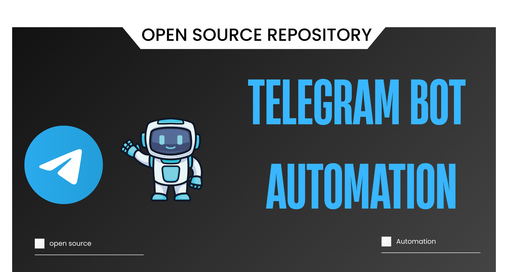

<p align="center">
  
</p>

🚀 **Telegram-Bot-Automation** is a Python-based bot designed to automatically fetch the latest tech news and updates from sources like Hacker News and deliver them straight to your Telegram channel. Now featuring **AI-Powered Summarization** for high-quality, developer-focused content.

## ✨ Features

- 📰 **Auto-Fetch News**: Scrapes RSS feeds (e.g., Hacker News) for the latest articles.
- 🤖 **AI Summarization**: Uses Hugging Face's Router API to rewrite tech news into engaging, professional Telegram posts.
- 🔍 **Targeted Content**: Focuses on Android, Flutter, Kotlin, Web Development, and Cybersecurity.
- ✉️ **Telegram Integration**: Sends beautifully formatted updates directly to your channel.
- 💾 **Persistence**: Uses SQLite to keep track of posted links and avoid duplicates.
- 🕒 **Scheduled Updates**: Runs periodically (default every 10 minutes) to keep your channel fresh.

## 🛠️ Tech Stack

- **Language**: Python
- **AI Engine**: Hugging Face Router API (`Llama-3.2-3B-Instruct`)
- **Libraries**: `requests`, `feedparser`, `sqlite3`, `beautifulsoup4`, `python-dotenv`
- **Database**: SQLite

## 🚀 Getting Started

### Prerequisites

- Python 3.8+
- A Telegram Bot Token (from [@BotFather](https://t.me/BotFather))
- A Telegram Channel ID
- A Hugging Face API Token (for the AI features)

### Installation

1. **Clone the repository**:

   ```bash
   git clone https://github.com/Miftah-Fentaw/Telegram-Bot-Automation.git
   cd Telegram-Bot-Automation
   ```

2. **Set up a virtual environment**:

   ```bash
   python -m venv venv
   source venv/bin/activate  # On Windows: venv\Scripts\activate
   ```

3. **Install dependencies**:

   ```bash
   pip install -r requirements.txt
   ```

4. **Configure Environment Variables**:
   Create a `.env` file in the root directory:
   ```env
   BOT_TOKEN=your_telegram_bot_token
   CHANNEL_ID=@your_channel_username
   HUGGINGFACE_API_KEY=your_huggingface_api_key
   ```

### Running the scripts

#### Standard Bot (Basic Summaries)

```bash
python main.py
```

#### AI Automated Bot (Professional Summaries & Rules)

```bash
python AI_automated.py
```

## 📜 Posting Rules (AI Version)

The AI automated script follows a strict set of rules to ensure quality:

- Professional, developer-focused tone.
- Contextual emojis and bold titles.
- Strict focus on Mobile, Web, and Cybersecurity.
- Automatic hashtagging: `#Programming #TechNews #DevLife #ManceTech`.

## 🤝 Contributing

Contributions are welcome! Please see [CONTRIBUTION.md](CONTRIBUTION.md) for guidelines on how to get started.

## 📜 License

This project is licensed under the MIT License - see the [LICENSE](LICENSE) file for details.
